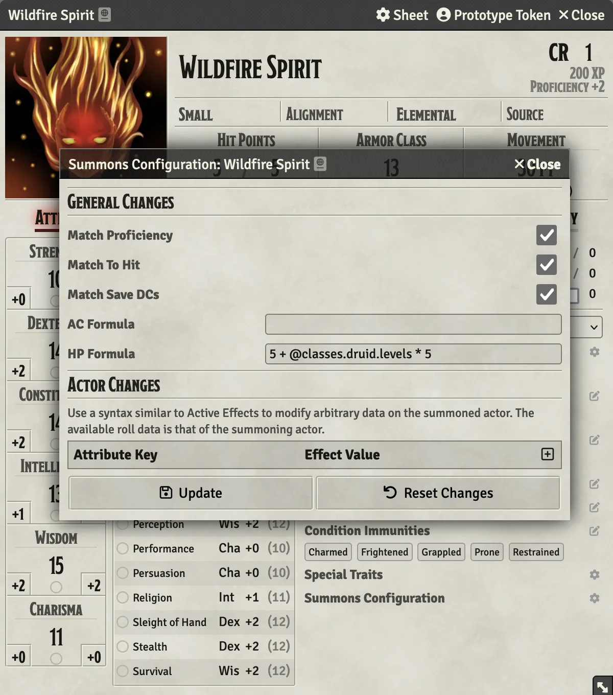
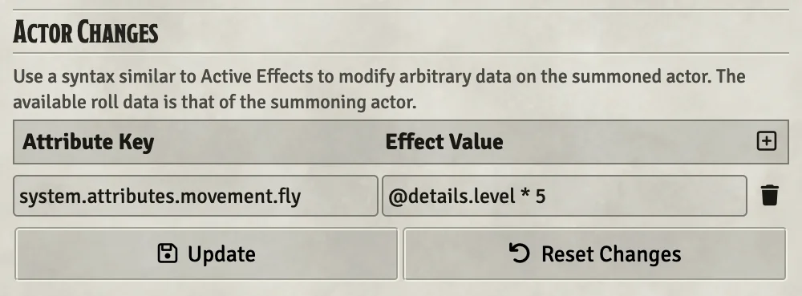
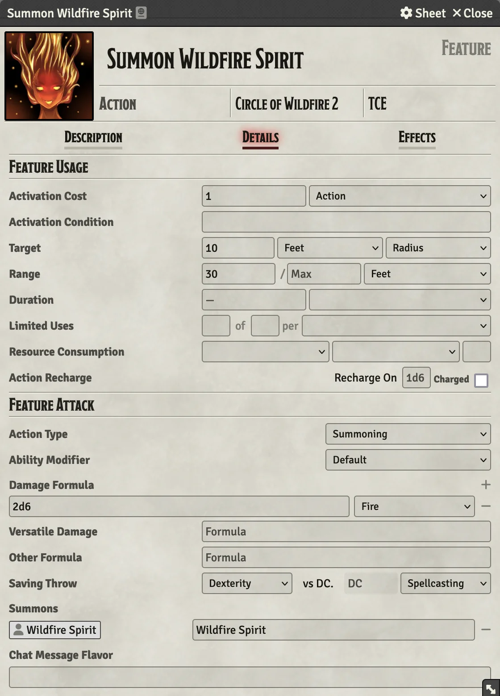

# Arbron’s Summoner

Easy to use interface for configuring and summoning actors within DnD5e.

This module is designed to make it easy as pie to summon creatures within DnD5e using a simple interface that integrates seamlessly into the standard 5e experience. The module makes use of Honeybadger's excellent [Warp Gate](https://github.com/trioderegion/warpgate) module to handle the creation and placement of the actors.

> ***Note:*** This module is designed to make it easy to implement spells like `"Summon Undead"` or `"Dancing Lights"` and features like `"Summon Wildfire Spirit"` that summon a specific actor template that requires modification based on the casting or caster level. It is not designed for spells like `"Conjure Woodland Beings"` that can summon any number of different types of creatures without modification.

### Step 1: Create & Configure Actor to Summon

First, create the actor you wish to summon with its default stats. For spells that summon several variants of a single creature template (such as `"Summon Undead"`), I recommend creating a single version initially and then splitting into variants once the initial configuration is complete to save work.

Next, click the `"Summons Configuration"` button that appears on the bottom of the default NPC sheet or within the `"Special Traits"` menu on other sheets to being customizing the configuration.

- **Match Proficiency**: Will modify the summoned creature's proficiency to equal that of the summoner.
- **Match To Hit**: Will modify the summoned creatures attacks to match the summoner's to hit value as best as possible.
- **Match Save DCs**: Will modify any feature with a save DC to use the save DC for the summoning spell or feature.
- **AC Formula** & **HP Formula**: Will adjust the summoned actor's values to match the formula entered. This formula takes roll data from the summoning feature, so `@item.level` will be the level of the spell cast, and `@details.level` will be the level of the caster.
- **Actor Changes**: Allows for additional active effect-like modifications to the summoned actor.

Once this configuration is complete, it is time to perform any necessary duplication to your actor to create variants. I also recommend placing these finished actors in a compendium before configuring your features.

### Step 2: Configure Summoning Features

Next, it is time to modify your feature or spell to handle the summoning. Open up the details page on your item and change the `"Action Type"` to the new `"Summoning"` type. This will display a new section near the bottom with a drop area. Drop the actor or actors you prepared above into this area to indicate they can be summoned.

The name field next to the item will change the name as displayed in the summoning window, but will not change the name of the summoned actor.

### Step 3: Get Summoning

Now you just need to use the feature or spell from your character sheet and you will be able to summon the creature:

The item usage window will allow you to decide whether you want something summoned at all, and if so, which of the variants you configured should be created. Once you are done with your summoned actor, simply use the `"Dismiss"` button on the sheet header to send them away.

